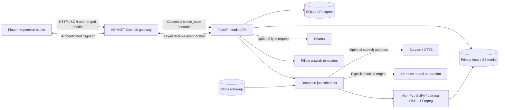

# Architecture

The database is authoritative for users, hashed sessions, versioned project documents, immutable snapshots, durable undo/redo stacks, consented voice profiles, jobs, assets, membership, publication, and events. SQLAlchemy provides SQLite for local use and Postgres for compose. Revision-checked updates prevent silent overwrite. The JSON document model is appropriate for evolving studio state; promote hot query fields into normalized/indexed tables when real traffic supports it.

One local worker processes jobs sequentially, with up to three pending jobs per project. It claims queued or stale jobs using revision compare-and-swap, snapshots input state, runs actual DSP outside the request loop, and writes durable progress/results. Redis shortens queue wake-up; a missing Redis never loses the database job. Cancellation is checked between processing stages and cannot interrupt an active native operation immediately. Workers use a 10-minute stale lease; very long external inference needs a longer/renewed lease before scaling to multiple workers.

The .NET gateway streams HTTP and byte ranges, preserves snake_case JSON, limits request rate/size, and controls origin access. MusicHub verifies tokens and project access before joining. Outbox relay rechecks current membership before delivering each event, so revoked sessions stop receiving updates. Flutter also replays authenticated events and polls job state for resilience. Tokens in SignalR query parameters must be redacted in production proxy logs.

Asset paths must stay under the configured private media root. Signed media URLs expire after one hour; possession grants playback until expiration, including after project revocation. Use short expirations or authenticated streaming where immediate revocation is required. Object storage remains private and the API resolves files; do not expose the media folder as static public content.

Flutter separates API/session/audio coordination (`studio_model.dart`) from the visual workspace (`studio_ui.dart`). A common master clock drives preloaded stem players and bounded skew correction. Live gain preview is limited to player-supported unit gain; rendered gain supports up to 2x and is bounded by peak protection. Effects apply to the rendered master. A/B uses measured LUFS to attenuate the louder master. This browser/native player arrangement is not sample-accurate professional DAW synchronization.

All visual metrics are derived from real decoded samples. Presets are deterministic original music without downloaded licensed loops. Imported separation offers clearly labeled approximate spectral DSP or an explicitly selected installed Demucs engine. Demucs must produce four actual decoded stems; failure never substitutes DSP. Its weights/hardware and real inference are external gates. Optional speech does not imply singing, identity cloning, or provider-free inference.

## Deployment gates

- Put the gateway behind HTTPS; publish only nginx, preserve persistent volumes and signing key.
- Verify Postgres migrations/backups, restore drill, Redis persistence, and S3 credentials/bucket policies against the actual deployment.
- Configure a dedicated internal key, origin allowlist, secret injection, expiry/retention policy, and provider quotas.
- Add email verification/password recovery before operating a public account service. The current account system is suitable for local/controlled portfolio demos.
- Audit logs/monitoring, storage quotas, malware scanning, moderator tooling and provider spending controls require production decisions; they are not represented as completed services.
